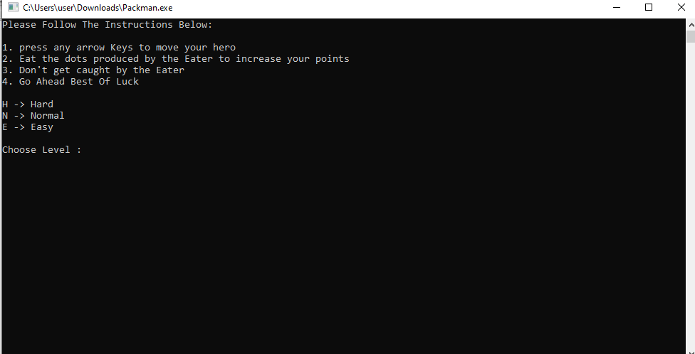

# Packman
Computer game implemented by C++ programming language. In this program, there are two types of character. One is hero(H) which is controlled by the user and another one is ghost(G) which is controlled by the computer. The ghost chases the hero and release eggs, the hero need to collect those eggs in order to increase point. If the ghost catches the hero then the game is over.

Output Snapshot 1:

Output Snapshot 2: (The structure of the field is designed as the short form of my univeristy name that is EWU(East West University)

